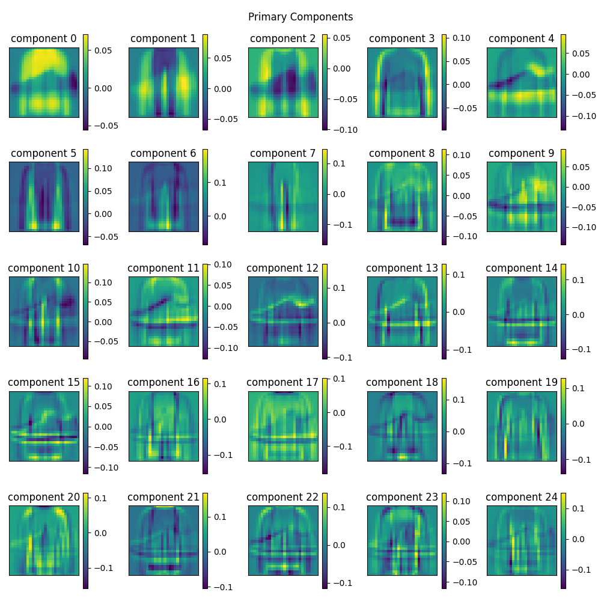
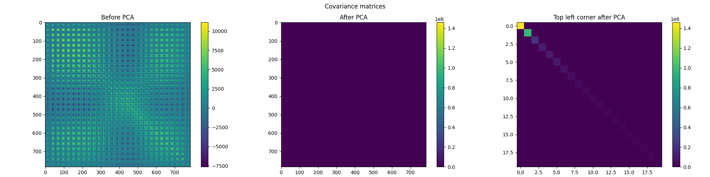
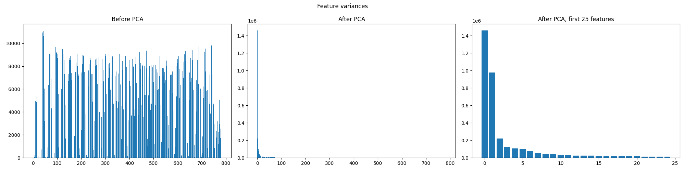
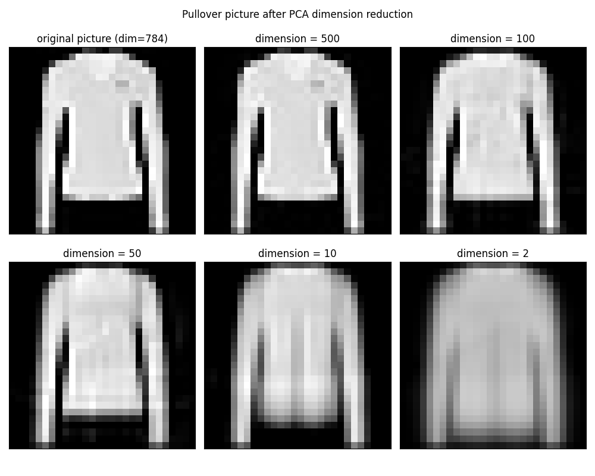
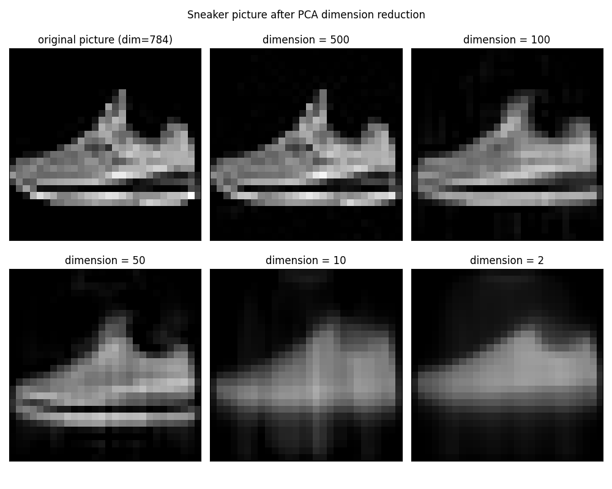
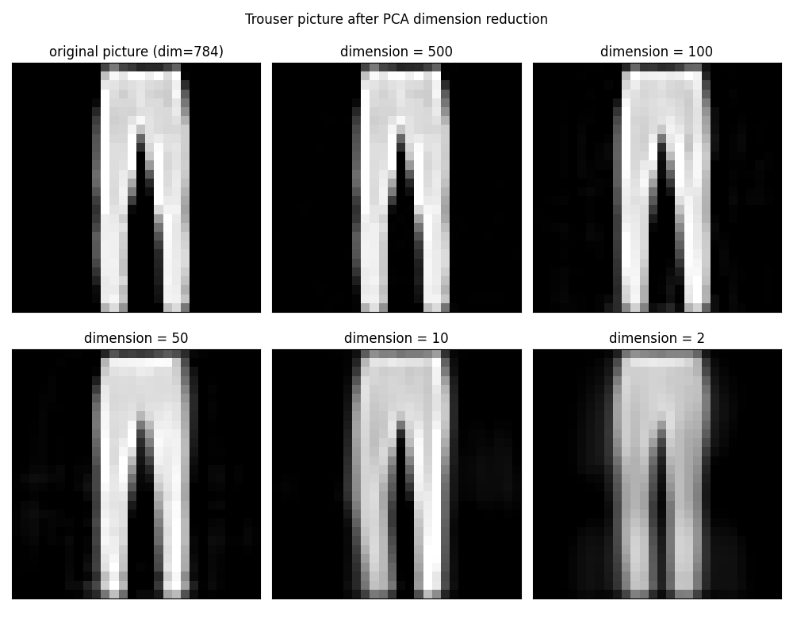
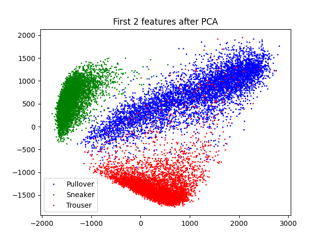

# Experiments with PCA on fashion mnist dataset
I will use 3 datasets (pullovers, sneakers and trousers) from mnist fashion dataset and observe how PCA method will affect the data.

# Primary Components
Visualization of the 25 first primary components (new vector basis for our data). First vectors carry most information.   

# Covariance Matrices
PCA minimized feature covariance  

# Feature Variances
After PCA the variance is cumulated in the few first features - the rest could be considered noise and discarded.  

# How dimension reduction affects data in original base
Few examples of how the data looks after dimension reduction (by discarding features with the least variance) after converting back to the original basis  
## Pullover

## Sneaker

## Trouser

# First two features plotted on 2D pane
After plotting the first two features of the data set, we  can see that first 2 they 
(after applying PCA - before that would be values of 2 first pixels on the picture) grouped the data into discernable clusters.  

